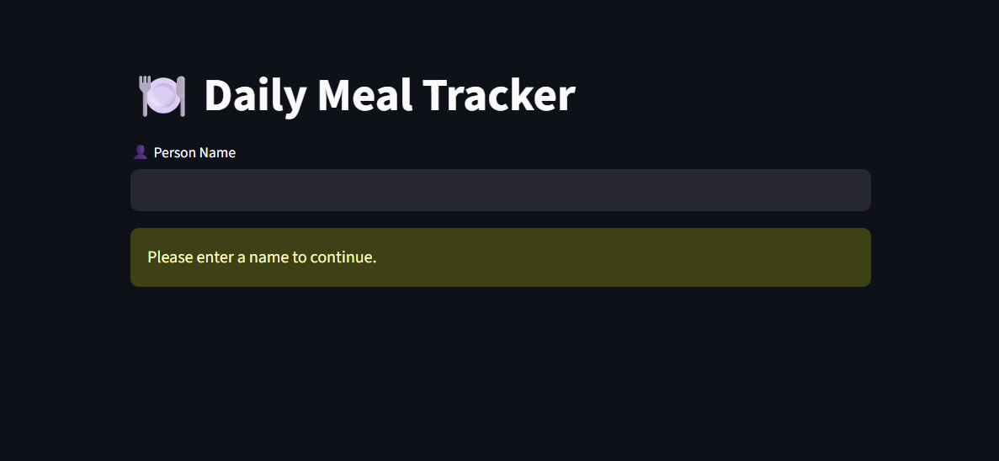
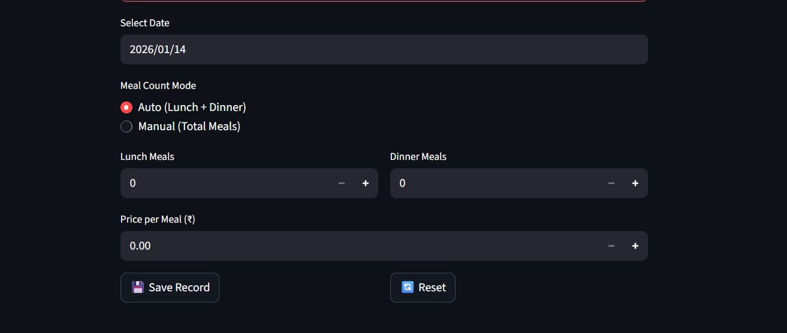
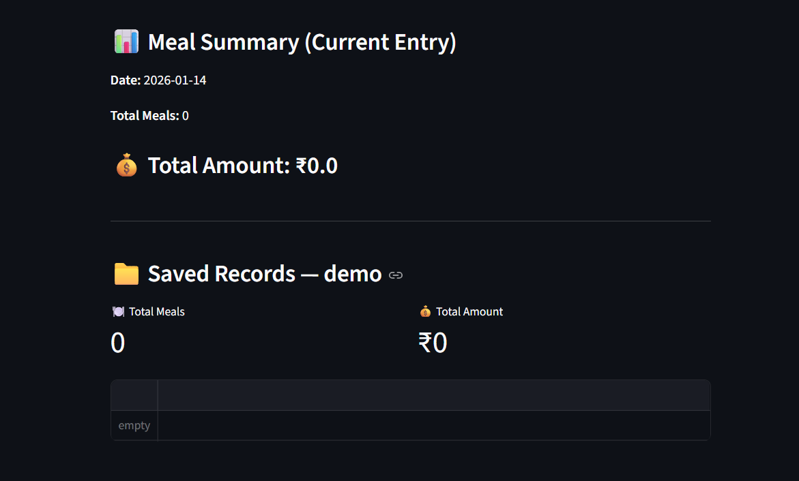
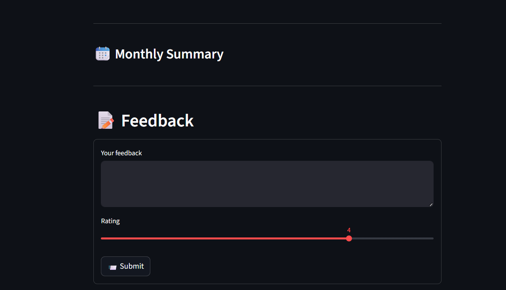

# 🍽️ Meal Tracker

A **Streamlit-based Meal Tracking application** that helps you record daily meals, calculate costs, and manage records **per person**.

The app uses **MongoDB** for storage and a centralized logging system for tracking all important actions like save, update, delete, exports, feedback, and admin operations—making it production-ready, debuggable, and scalable.

---

## ✨ Features

* 👤 **Person-wise meal tracking** (name-based)
* 📅 Track meals **per day**
* 🔄 Two meal entry modes:

  * **Auto**: Lunch + Dinner
  * **Manual**: Total meals directly
* 💰 Automatic meal cost calculation
* 💾 Store data in **MongoDB** (local or cloud – MongoDB Atlas)
* 📊 View all saved records in a table (per person)
* 🧮 **Total meals & total amount summary**
* 📆 **Month-wise filtering & reports**
* 📊 **Charts (Meals vs Date)**
* ✏️ Edit existing records (ID-based)
* 🗑 Delete records safely
* 📤 **Export data to CSV & Excel**
* 📝 **Feedback system** (user feedback with ratings)
* 🔐 **Admin feedback panel** (password protected)
* 🔄 Reset input form without deleting saved data
* 🪵 **Centralized logging** for all major actions (save, update, delete, export, feedback, admin)

---

## 📸 Screenshots

### 🏠 Home Page



### 🍽 Meal Entry Form



### 📊 Meal Summary & Reports



### 📝 User Feedback



---

## 🛠️ Tech Stack

* **Python 3.9+**
* **Streamlit**
* **MongoDB**
* **PyMongo**
* **Pandas**
* **openpyxl**
* **logging**

---

## 📂 Project Structure

```
Meal-Tracker/
├── app.py                  ✅ Streamlit entry point
├── db_connection.py        ✅ MongoDB logic
├── logger.py               ✅ Centralized logging
├── requirements.txt        ✅ Dependencies
├── Dockerfile              ✅ Container support
├── README.md               ✅ Docs
├── .streamlit/
│   └── secrets.toml        ✅ Secrets (local/cloud)
├── .github/workflows/
│   └── ci.yml              ✅ CI pipeline
├── screenshots/            ✅ README assets

```

---

## 🚀 Installation & Run

### 1️⃣ Clone the repository

```bash
git clone https://github.com/Jagyasenbhatra/Meal-Tracker.git
cd Meal-Tracker
```

### 2️⃣ Install dependencies

```bash
pip install -r requirements.txt
```

### 3️⃣ Configure secrets

Create `.streamlit/secrets.toml`:

```toml
MONGO_URI = ""
ADMIN_PASSWORD = ""
```

---

### 4️⃣ Run the app

```bash
streamlit run app.py
```

---

## 📋 How to Use

1. Enter **Person Name**
2. Select **date**
3. Choose meal mode (Auto / Manual)
4. Enter **price per meal**
5. Save record
6. View totals & reports
7. Edit / delete records
8. Export data
9. Submit feedback
10. Admin manages feedback

All actions are logged via `logger.py`.

---

## 🧠 Database Details

* MongoDB collections:

  * `meals`
  * `feedback`
* ObjectId-based updates
* Cloud-ready & scalable

---

## 🪵 Logging Details

* Centralized logging via `logger.py`
* Tracks:

  * Save / update / delete
  * Export actions
  * Feedback activity
  * Admin access
* Useful for debugging & auditing

---

## 🔁 CI/CD & Deployment

This project includes **automated CI jobs** using **GitHub Actions** and supports **deployment on Streamlit Cloud**.

### ✅ Continuous Integration (CI)

On every **push or pull request** to `main` or `develop`, the CI pipeline runs:

* 🧹 **Black** – code formatting check
* 🔍 **Flake8** – linting
* 🧪 **Pytest** – test execution (optional)
* 🐳 **Docker build** – validates container readiness

CI workflow file:

```
.github/workflows/ci.yml
```

This ensures code quality and prevents broken deployments.

---

### ☁️ Deployment on Streamlit Cloud

The app can be deployed directly on **Streamlit Cloud**.

**Steps:**

1. Push code to `main`
2. Create a new app on Streamlit Cloud
3. Select this GitHub repository
4. Set:

   * **Main file**: `app.py`
   * **Python version**: `3.10+`
5. Add secrets:

   ```toml
   MONGO_URI = ""
   ADMIN_PASSWORD = ""
   ```
6. Deploy 🚀

Once CI passes, Streamlit Cloud pulls the latest code and deploys automatically.

---

## 📦 Requirements

```txt
streamlit>=1.31.0
pandas>=1.5.0
pymongo>=4.6.0
openpyxl>=3.1.0
```

---

## 🔒 Notes

* Records are isolated per person
* Reset clears only input fields
* Admin access is password-protected
* MongoDB Atlas supported
* Suitable for personal or small-team use

---

## 🔮 Future Enhancements

* Date-range filtering
* Advanced charts
* PDF invoice generation
* Authentication & roles
* Email notifications
* MongoDB aggregation analytics
* Cloud logging (ELK / CloudWatch)

---

## 👨‍💻 Author

**Jagyasen**
Backend Engineer | Python | Streamlit | Databases
